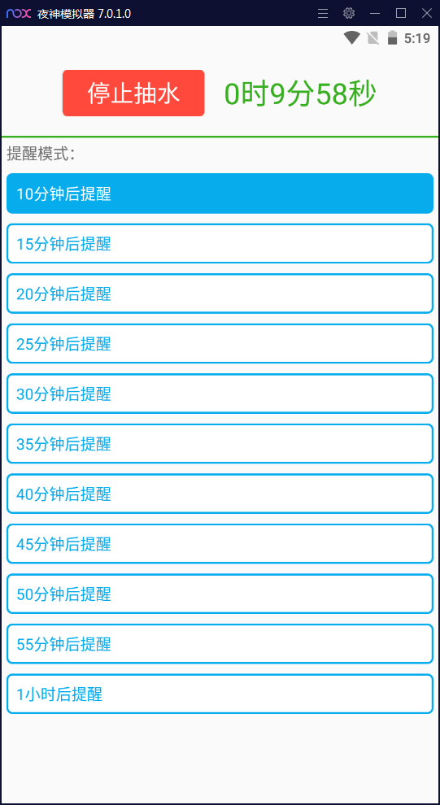

# 带有闹钟定时功能的抽水提醒APP
### 开发语言：java
### 开发工具：Android Studio
## 项目简述：
说一下开发这个APP的初衷，家里的水塔要手动抽水，水抽满后需要人工关掉抽水机的电源开关，不然抽水机空转时会非常耗电。老人不太会使用智能手机，而且使用手机自带的闹钟很麻烦，为了更简单一些，所以开发了这款APP。
## 技术难点：
1. 动态权限申请
2. 锁屏下唤醒屏幕
3. 使用服务、广播、通知
## 软件截图：
